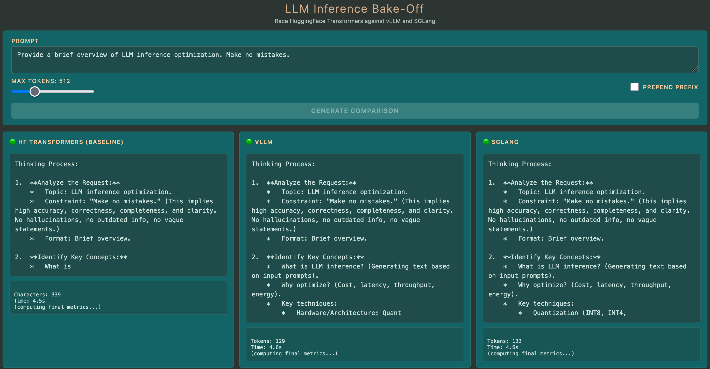

# LLM Inference Bake-Off

LLM serving with vLLM and SGLang on Modal.

## Overview
Run three experiments to measure different features:

1. Baseline comparison
2. Multi-token prediction
3. Prefix caching
4. Concurrent requests

Experiments 1-3 use a single request only and show their outputs in a text streaming UI based on FastAPI.

For more detail, see [the blog post on Tensorlabbet](https://tensorlabbet.com/2026/05/18/hands-on-llm-inference-serving/).




## Setup

```bash
# Install dependencies
uv sync

# Authenticate with Modal (this requires an account)
uv run modal setup
```

## Deployment

#### Experiments 1, 2 and 3

```bash
uv run modal serve src/llminferencebakeoff/serve.py
```

**Single command** deploys everything:
- HuggingFace Transformers backend (naive baseline, no continuous batching)
- SGLang backend
- vLLM backend with PagedAttention
- 3-way comparison UI

Open the URL and watch real-time performance comparison across all three backends.

Modify config.py to run the different experiments.


**First request behavior:**
- GPU containers spin up on-demand when you click "Generate Comparison"
- HuggingFace Transformers: ~35-40s (model loading only)
- SGLang/vLLM: ~60-90s (model loading + CUDA graph compilation)
- Subsequent requests (within 5 minutes): ~4-5s for all backends
- Containers automatically scale down after 5 minutes of inactivity

> **Cost warning:** `min_containers=1` keeps all three GPU containers running continuously.
Terminate with ctrl + c or run `modal app stop LlmInferenceBakeOff` when not in use.

#### Experiment 4

```bash
uv run modal run src/llminferencebakeoff/benchmark_concurrent.py
```

Note that the HuggingFace Transformers backend is currently commented-out to save costs.
